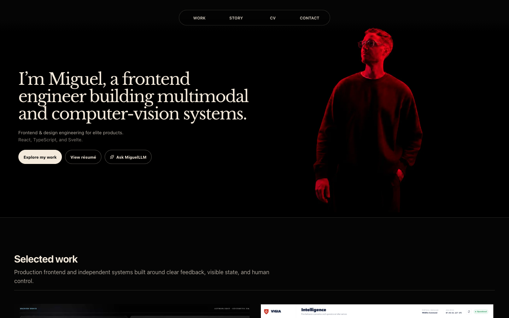
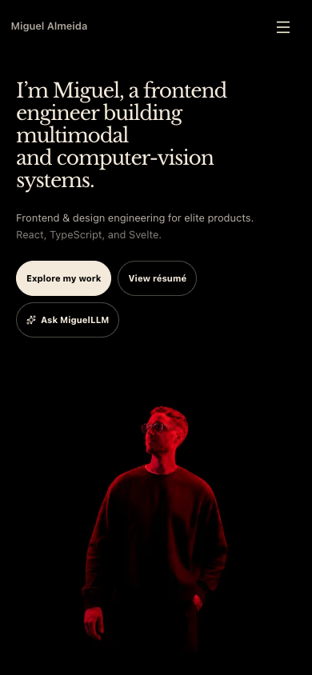

# Miguel Almeida — Portfolio


[Live portfolio ↗](https://miguelalmeida.is-a.dev) *(external — leaves GitHub)*
**Frontend engineer building ambitious interactive systems across voice, AI, operational data, native learning, and design tooling.**

<p align="center">
  
</p>

**Live:** https://miguelalmeida.is-a.dev *(external — leaves GitHub)*

This repository is the engineering layer behind my portfolio. The site is deliberately closer to an editorial product story than a generic project-card grid: the work is presented through interaction, technical decisions, constraints, and verifiable artifacts.

## Selected work

The portfolio brings together work across:

- **voice-first interaction** and conversational state;
- **crisis intelligence** and geospatial operational interfaces;
- **native iOS learning** and document interaction;
- **local-first multimodal UI**;
- **design systems and AI-agent tooling**;
- production frontend architecture, performance, accessibility and QA.

## Experience flow

```mermaid
flowchart LR
  LAND(["Landing"]):::actor
  WORK["Selected work"]:::data
  STORY["Project story"]:::system
  DECISIONS["Technical decisions"]:::system
  STATUS["Constraints + claim status"]:::guard
  CONTACT(["Contact / CV"]):::safe

  LAND --> WORK --> STORY --> DECISIONS --> STATUS --> CONTACT

  classDef actor fill:#E8F1FF,stroke:#2563EB,color:#0F172A,stroke-width:1.6px;
classDef system fill:#ECFEFF,stroke:#0891B2,color:#0F172A,stroke-width:1.6px;
classDef decision fill:#FFFBEB,stroke:#D97706,color:#0F172A,stroke-width:1.6px;
classDef guard fill:#FFF7ED,stroke:#EA580C,color:#0F172A,stroke-width:1.6px;
classDef safe fill:#ECFDF5,stroke:#059669,color:#0F172A,stroke-width:1.6px;
classDef private fill:#FFF1F2,stroke:#E11D48,color:#0F172A,stroke-width:1.6px;
classDef data fill:#F8FAFC,stroke:#64748B,color:#0F172A,stroke-width:1.6px;
linkStyle default stroke:#94A3B8,stroke-width:1.5px;
```



## Stack

- SvelteKit 2 / Svelte 5
- TypeScript
- Tailwind CSS 4
- Vite
- Cloudflare Pages / Functions
- Playwright
- server-generated PDF CV

## Architecture

```text
src/lib/content/
├── folio.ts                 profile / experience / navigation
├── case-studies.ts          typed project narratives + claim status
└── project-media.ts         approved visual assets

src/lib/components/
└── case-study/              reusable editorial presentation

src/routes/
├── work/[slug]/             project case studies
├── api/miguel-llm/          bounded server-side assistant route
└── cv / portfolio.pdf       shared resume output

docs/qa/                     visual + production verification
```

## Claim discipline

Project claims carry explicit status instead of being flattened into marketing language:

- verified;
- partial;
- historical;
- synthetic;
- proposed;
- not implemented.

That matters because several projects involve AI, perception, or operational systems where a polished UI can otherwise imply more certainty than the implementation supports.

## Responsive preview

The desktop capture above is one viewport, not a stitched full-page image. The mobile viewport is shown separately at phone scale.

<p align="center">
  
</p>

<p align="center"><sub>Mobile viewport · 390px-class layout</sub></p>

[Capture provenance](./docs/readme/previews/PROVENANCE.json)

## Engineering priorities

### Performance

Offscreen media is lazy, client work is bounded, layouts are designed to avoid horizontal overflow, and visual QA is separated from production runtime artifacts.

### Accessibility

The implementation targets semantic landmarks, keyboard-operable navigation/dialogs, visible focus, useful touch targets, reduced-motion behavior, and readable supporting text.

### Security

Provider secrets remain server-side. Public AI-assisted surfaces use bounded input/output, rate limiting, and deterministic fallbacks rather than exposing provider credentials in the browser.

### Content architecture

Case studies are structured data instead of scattered page copy, allowing the web portfolio and PDF/CV surfaces to share factual source material.

## Run locally

```bash
git clone https://github.com/miguelalmeida0/portfolio.git
cd portfolio
git checkout portfolio
npm install
npm run dev
```

Useful checks:

```bash
npm run lint
npm run build
npm run e2e
```

## A note on professional work

F24 appears as professional experience, not as a fabricated public case study. Private employer implementation details, customer information, screenshots, and internal metrics are intentionally excluded.

---

Designed and built by [Miguel Almeida](https://github.com/miguelalmeida0).

[Repository guide](./docs/START_HERE.md)

<!-- repository-presentation-repair:1 -->
